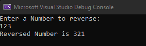

# Recursive-function

## Aim: 
To write a C# program to reverse a number using recursive function.

## Algorithm:
### Step 1:
Create a project.
### Step 2:
Now write a function using logic to reverse the number.
### Step 3:
Recurse the function within the previously created function.
### Step 4:
Now create the Main() function and call the recursed function.
### Step 5:
Display the Result.
### Step 6:
End the Program.
## Program:
```
using System;
namespace hello
{
    class Program
    {
        int rem = 0, rev = 0;
        public int reverse(int n)
        {
            rem = n % 10;
            if (rem == 0) return rev;
            else
            {
                rev = rev * 10 + rem;
                return reverse(n / 10);
            }
        }
        static void Main(string[] args)
        {
            int n;
            Console.WriteLine("Enter a Number to reverse: ");
            n = Convert.ToInt32(Console.ReadLine());

            Program p1 = new Program();
            Console.WriteLine("Reversed Number is " + p1.reverseNo);
        }
    }
}
```
## Output:

## Result:
We have successfully created reversed the number given by the user using recursive functions.
